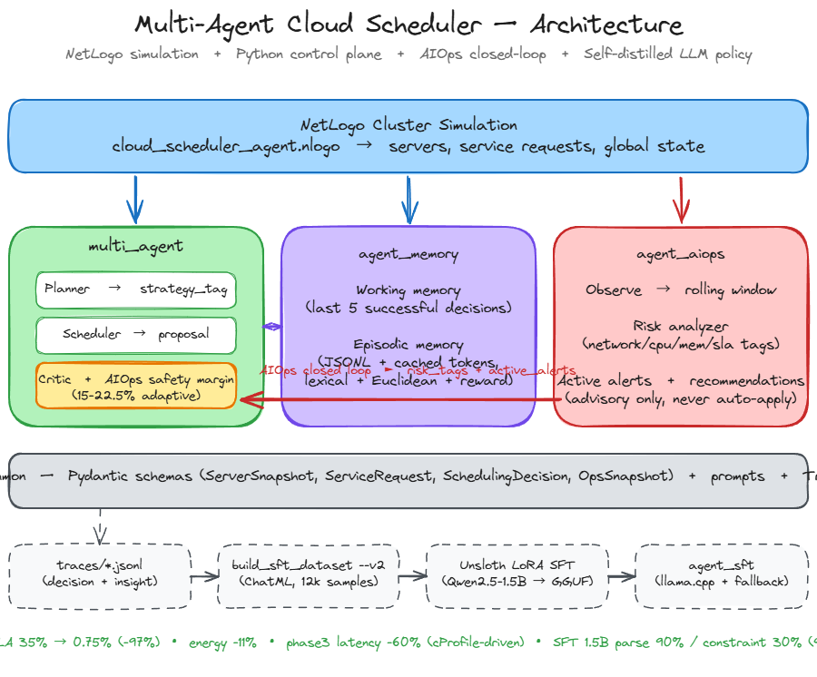
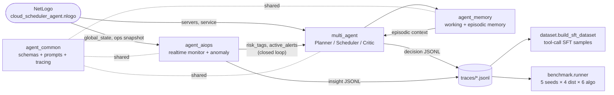

# 多智能体云调度系统 / Multi-Agent Cloud Scheduler

把 NetLogo 数据中心调度仿真扩展为一个分阶段演进的 LLM Agent 调度系统。核心设计不是让 LLM 替代每一次高频 placement，而是把 Agent 放在控制层：常规请求由毫秒级 fast path 处理，复杂场景、Critic 校验、历史案例检索、AIOps 异常检测和离线 trace 再交给 Agent 模块参与。

## 当前完成内容 / Completed Scope

当前仓库已经完成从 NetLogo baseline 到 Agent-assisted scheduling 的端到端闭环，包含仿真接入、调度控制层、监控闭环、评测、数据蒸馏和可视化文档。

| 模块 | 完成内容 | 当前状态 |
|---|---|---|
| NetLogo 仿真 | `cloud_scheduler_agent.nlogo` 保留 first-fit / balanced-fit baseline，并新增 `AI-phase2`、`AI-phase3`、AIOps 观测入口。Python 返回 `server_id`、`-1` fallback、`-2` reject，NetLogo 负责最终兜底和拒绝语义。 | 可运行 |
| 公共契约层 | `agent_common` 统一 Pydantic schema、prompt 渲染和 JSONL tracing，保证各 Agent 输入输出结构稳定。 | 已落地 |
| Phase 2 控制层 | `multi_agent` 提供 Planner-Scheduler-Critic control plane，默认走 deterministic hybrid fast path；`backend="structured"` 或 `hybrid_agent_mode="sync"` 才进入本地 LLM。 | 已落地 |
| Phase 3 调度记忆 | `agent_memory` 实现 working memory + episodic retrieval，把相似历史案例作为 `memory_context_raw` 注入调度控制层。 | 已落地 |
| AIOps 闭环 | `agent_aiops` 每 tick 分析 CPU/MEM/NET、SLA、迁移和容量风险，输出 risk tags、active alerts、guardrail 建议，并把 insight 回注给 `multi_agent` critic 收紧安全边际。 | 已落地 |
| Dashboard | `dashboard/` 提供静态和 live server 两种模式，可以展示服务器矩阵、风险趋势、资源趋势、建议、guardrails 和事件流。 | 已落地 |
| Benchmark | `benchmark.runner` 批量比较 6 条策略路径，输出 SLA、拒绝率、fallback、能耗代理、延迟、AIOps 触发率等指标。 | 已落地 |
| SFT/LoRA 蒸馏 | `dataset.build_sft_dataset` 支持 OpenAI tool-call v1 与 ChatML v2；`dataset/train_lora_unsloth.py` 支持 Unsloth 训练；`agent_sft` 支持 GGUF 推理、严格 tool-call 解析和 deterministic fallback。 | 已落地 |
| 测试与文档 | `tests/` 覆盖 scheduler、memory、AIOps、dashboard、trace、benchmark、NetLogo 集成片段和 SFT parser；`docs/` 保留设计、开发日志、演示脚本和简历材料。 | 已落地 |

## 文档索引 / Documentation Map

| 文档 | 说明 |
|---|---|
| `README.md` | 项目主入口：完成内容、架构、关键结果、运行方式、AIOps、SFT、Dashboard、限制。 |
| `HANDOFF_TO_COWORK.md` | 面向维护者的技术路线移交，说明当前架构原则、Phase 1 退役、Phase 2/3、AIOps、benchmark 和后续路线。 |
| `multi_agent/README.md` | `multi_agent` 的定位、backend 模式、公共 API、关键观测字段和 structured Agent demo。 |
| `dashboard/README.md` | AIOps dashboard 的页面内容、数据格式、导出方式和 live NetLogo 同步方式。 |
| `docs/architecture.md` | Excalidraw 架构图的查看、导出、分层布局、箭头含义和配色说明；本 README 已合并其核心架构内容。 |
| `docs/architecture.png` | README 中展示的架构主图，适合直接用于仓库首页、简历和演示材料。 |
| `docs/architecture.excalidraw` | 可编辑架构图源文件，可在 Excalidraw 或 VSCode 插件中打开。 |
| `docs/aiops_agent.md` | AIOps Agent 的 API、内部角色、实时数据流和输出契约。 |
| `docs/development_log_phase2_latency.md` | Phase 2 本地 LLM 调度延迟、tool calling、全局风险和 memory-aware 设计记录。 |
| `docs/development_log_ai_ops_monitoring.md` | 从 Agent 调度器演进到 AIOps 监控层的开发日志和实验分析。 |
| `docs/report_draft.md` | 技术报告草稿，包含背景、方法、实验计划和限制。 |
| `docs/demo_script.md` | 演示流程脚本，适合录屏或面试讲解。 |
| `docs/resume_bullets.md` | 项目亮点精简版，可直接改写进简历。 |
| `docs/superpowers/plans/2026-04-29-risk-aware-hybrid-agent.md` | 风险感知 hybrid agent 的历史实现计划。 |

## 仓库结构 / Repository Map

```text
agent_common/      shared schemas, prompts, tracing
multi_agent/       Phase 2 Planner-Scheduler-Critic control plane
agent_memory/      Phase 3 working + episodic scheduling memory
agent_aiops/       realtime AIOps monitor, risk analyzer, guardrails
agent_sft/         SFT/LoRA GGUF inference adapter with strict fallback
benchmark/         benchmark matrix, NetLogo smoke experiment config, results
dataset/           trace-to-SFT dataset builders and LoRA training scripts
dashboard/         static dashboard, exporter, live trace server
demo/              AIOps closed-loop A/B demo
docs/              architecture notes, development logs, report/demo/resume docs
scripts/           plotting utilities
tests/             unit and integration-style regression tests
traces/            JSONL trace output directory
```

## 架构 / Architecture



架构图源文件位于 `docs/architecture.excalidraw`，PNG 版本位于 `docs/architecture.png`，查看和导出说明见 `docs/architecture.md`。README 中先展示手绘架构图，下面保留 Mermaid 版本作为可读文本 fallback。

### 分层说明

系统分为四层：

1. **仿真输入层**：`cloud_scheduler_agent.nlogo` 生成服务器状态、服务请求和全局运行态。NetLogo 仍然掌握最终调度语义，Python Agent 只返回 select / fallback / reject 信号。
2. **控制层**：`multi_agent`、`agent_memory`、`agent_aiops` 并排工作。`multi_agent` 负责 Planner → Scheduler → Critic；`agent_memory` 提供相似历史案例；`agent_aiops` 负责低频风险监控和 guardrail 建议。
3. **公共基础层**：`agent_common` 提供 schema、prompt 和 trace，不让不同 Agent 各自发明输入输出格式。
4. **离线蒸馏层**：`traces/*.jsonl` 进入 `dataset.build_sft_dataset --v2`，生成 ChatML SFT 样本，再通过 Unsloth LoRA 训练和 `agent_sft` 推理适配器做对比实验。

### 运行时闭环

每次调度时，NetLogo 把候选服务器和服务请求传给 Phase 2/3。常规请求由 `multi_agent` fast path 直接返回；复杂请求会记录 escalation、risk policy、memory metadata 和 critic 解释。AIOps 侧每 tick 读取全局运行态，产生 `risk_tags`、`risk_level` 和 `active_alerts`；这些信号回注给 `multi_agent` critic 后，会在 network/cpu/memory/SLA/capacity 风险上收紧安全边际。高风险 placement 返回 `-1`，由 NetLogo 的 balanced-fit 接手兜底。

### 关键契约

- Python 调度函数只返回整数：`>=0` 表示选择服务器，`-1` 表示 fallback，`-2` 表示 reject。
- Python 只能在 NetLogo 给出的候选服务器集合内做选择，不能绕过 `the-server-set` 使用全局服务器。
- 高频仿真默认不同步调用 LLM；structured Agent 仅用于短 demo、离线 trace 或手动打开的 sync 模式。
- 所有关键决策都写入 JSONL trace，benchmark、dashboard、dataset 和 SFT pipeline 都复用同一批 trace。



四个 Agent 模块各司其职：

- **agent_common**：共享 Pydantic schema、prompt 模板、TraceLogger。所有 Agent 的输入输出都过同一套硬约束。
- **multi_agent**：Planner-Scheduler-Critic control plane，默认 hybrid fast path。`backend="structured"` / `hybrid_agent_mode="sync"` 才同步调用本地 LLM。
- **agent_memory**：working memory + episodic retrieval（词袋重叠 + 欧氏距离 + reward 加权）。把相似历史调度案例作为 `memory_context_raw` 传给 multi_agent。
- **agent_aiops**：realtime ops 监控 + 异常检测 + 策略建议。每 tick `observe_ops_state(...)` 计算 risk_tags / active_alerts；闭环把信号注入 multi_agent 的 critic，强制收紧安全边际。

## Headline Results

5 seeds × 4 distributions × 6 algorithms（每场景 100 请求，cluster 初始利用率 45-70%）的均值：

| 算法 | SLA 违约率 | 拒绝率 | Fallback 率 | 能耗 | 平均延迟 | P95 延迟 | AIOps 触发率 |
|---|---|---|---|---|---|---|---|
| first-fit | 40.60% | 43.05% | 0% | 861 | 0.6 μs | 0.8 μs | — |
| balanced-fit | 34.55% | 43.70% | 0% | 855 | 2 μs | 4 μs | — |
| AI-phase2 | 36.05% | 41.90% | 0% | 856 | 80.7 μs | 122.5 μs | — |
| AI-phase3 | 33.50% | 44.45% | 0% | 856 | 270.7 μs | 435.9 μs | — |
| **AI-phase2 + AIOps** | **0.75%** | 21.25% | 64.65% | **767** | 120.4 μs | 188.2 μs | 80.1% |
| **AI-phase3 + AIOps** | **0.75%** | 22.30% | 64.30% | 770 | 196.1 μs | 294.5 μs | 79.5% |

**核心发现**：

- AIOps 闭环把 SLA 违约率从 33-40% **降到 0.75%**（>97% 相对降幅），同时能耗节省约 **11%**（855→767）。
- 代价是 fallback 率 64%——AIOps critic 把高风险放置以 -1 哨兵值打回 NetLogo 的 balanced-fit 兜底；纯 benchmark 下 fallback 不被回收，但 NetLogo 实跑会被 `find-balanced-fit-server` 接住。
- AIOps 信号**稀释了 phase3 的记忆优势**：phase2-aiops 与 phase3-aiops 的 SLA 数字完全一致 (0.75%)，说明在强外部信号下 episodic memory 的边际收益消失。
- phase3-aiops 延迟 (196.1 μs) **低于** phase3 (270.7 μs)：AIOps 让 64% 请求走 fallback，跳过 episode 写盘，证明 AIOps 不仅过滤决策也过滤了"记忆污染"。
- Pareto 前沿：**AI-phase2 + AIOps** 在 (SLA, latency) 平面的左下角，是综合最优。

**Profile-driven 延迟优化**（cProfile + snakeviz 定位热点后两步改动）：

| 算法 | 优化前 avg | 优化后 avg | 降幅 | 优化前 P95 | 优化后 P95 | 降幅 |
|---|---|---|---|---|---|---|
| AI-phase2 | 104 μs | 80.7 μs | -22% | 167 μs | 122.5 μs | -27% |
| AI-phase3 | 678 μs | 270.7 μs | **-60%** | 1071 μs | 435.9 μs | -59% |
| AI-phase2 + AIOps | 150 μs | 120.4 μs | -20% | 205 μs | 188.2 μs | -8% |
| AI-phase3 + AIOps | 357 μs | 196.1 μs | **-45%** | 648 μs | 294.5 μs | -55% |

总 benchmark 时间从 6.16s 降到 4.81s (-22%)。两步关键修改：
1. **`_token_overlap` 占 22% cumtime** → 在 `Episode` 用 `PrivateAttr` 缓存 frozenset 化 token，retrieve 时不再重复分词；query 端也只 tokenize 一次。
2. **`pathlib.open` 占 7% cumtime** → `EpisodicMemory` 改成长开文件句柄 + `flush_every` 批量刷盘，benchmark 模式直接 `persist=False` 跳过磁盘 I/O。

附带：`_cluster_fragmentation` 用单遍 `E[X²]-E[X]²` 替换 `statistics.pstdev`（13.9% → < 2%），`_parse_context` 用 `model_construct` 跳过 Pydantic field validation。

**Demo 闭环对比**（`demo/aiops_closedloop_demo.py`，mixed-burst 工况，初始利用率 60-80%）：

> 同一 workload + 同一初始集群，demo 会输出启用 AIOps 前后的 SLA 违约数、reject 数、平均延迟和 P95 延迟，适合直接录屏展示闭环效果。

Pareto 散点图见 `benchmark/results/pareto_*.png`。

## Quickstart

```powershell
# 1. 创建虚拟环境
py -3.13 -m venv .venv
.\.venv\Scripts\python -m pip install -r requirements.txt

# 2. 跑全量单元测试
.\.venv\Scripts\python -m pytest tests -q

# 3. AIOps 闭环 demo (A/B 对比，约 1 秒)
.\.venv\Scripts\python -m demo.aiops_closedloop_demo

# 4. 完整 benchmark (5 seed × 4 dist × 6 algo = 120 行 csv)
.\.venv\Scripts\python -m benchmark.runner

# 5. 出 Pareto 图 (需要 matplotlib)
.\.venv\Scripts\python -m pip install matplotlib
.\.venv\Scripts\python -m scripts.plot_pareto

# 6. 把 trace 导出成 SFT 数据集
.\.venv\Scripts\python -m dataset.build_sft_dataset             # v1: OpenAI tool_calls 格式
.\.venv\Scripts\python -m dataset.build_sft_dataset --v2 --max-samples 12000  # v2: ChatML，Unsloth 用

# 7. (可选) 训 LoRA — 推荐 Colab T4 免费版
#    把 dataset/cloud-sched-sft-v2.jsonl 上传到 Colab 后跑：
#    !pip install "unsloth[colab-new] @ git+https://github.com/unslothai/unsloth.git"
#    !python dataset/train_lora_unsloth.py
#    训完拿回 dataset/qwen25-1p5b-sched-merged-q4.gguf

# 8. (可选) 跑 SFT 模型作为第 7 个算法对比
.\.venv\Scripts\python -m pip install llama-cpp-python
# benchmark/runner.py 把 algorithms 列表加上 "AI-sft-1.5b" 再跑
```

## SFT/LoRA 蒸馏 pipeline (可选)

`agent_sft/` 提供了完整的 self-distillation 路径：用 multi_agent + critic 跑出来的 trace 当 ground truth → SFT JSONL → LoRA 微调 Qwen2.5-1.5B → 端到端推理对比。

```text
benchmark.runner ──→ traces/*.jsonl ──→ build_sft_dataset --v2 ──→ cloud-sched-sft-v2.jsonl
                                                                            │
                                                                            ▼
                                                        train_lora_unsloth.py (Colab T4)
                                                                            │
                                                                            ▼
                                                  dataset/qwen25-1p5b-sched-merged-q4.gguf
                                                                            │
                                                                            ▼
                                       agent_sft.schedule_service ←─ benchmark.runner ("AI-sft-1.5b")
```

agent_sft 推理路径有完整的 fallback：parse fail / hallucinated server_id / 越界值 → 自动走 balanced-fit 兜底，benchmark 不会因为模型抽风而崩。`sft_stats()` 输出 parse_success_rate / hallucination_rate / avg_inference_ms 供面试讲故事。

**实测对比**（5 seed × 4 dist 均值）：

| 算法 | SLA 违约率 (per total) | per-placement SLA | Fallback 率 | 平均延迟 | P95 延迟 |
|---|---|---|---|---|---|
| balanced-fit | 35% | 57% | 0% | 2 μs | 4 μs |
| AI-phase2 + AIOps | 0.75% | 4% | 65% | 120 μs | 188 μs |
| **AI-sft-1.5b (Q4 GGUF)** | 22% | **56%** | **60%** | **509 ms** | **698 ms** |

**Self-distillation 实测核心发现**：

- **延迟代价 4240×**：SFT 推理延迟 509ms vs multi_agent + AIOps 的 120μs，验证了**fine-tuned 小 LLM 在 sub-ms 控制平面不可接受**。
- **Format 学会了，constraint 没学会**：60% 的 placement 是 overload_attempts——模型 pick 出来的 server_id 在 cluster 里存在但容量不够。`parse_success_rate ≈ 90%`（语法学会了），但 per-placement SLA 56%（约束没学会）。
- **Reject 路径没学到**：rejection_rate=0%，1.5B 模型的 sycophancy 倾向 + reject 样本占比不足，导致 SFT 没学会"无解就拒绝"。需要后续用 DPO / RLHF 用约束违反信号矫正。
- **Deterministic fallback 必不可少**：agent_sft 的 balanced-fit 兜底吸收了 60% 的失败请求，没有这层兜底 benchmark 直接崩。这是 LLM agent 工程原则的实证。

> **Resume 用的核心叙事**：用 12k 自蒸馏 trace 训练 Qwen2.5-1.5B LoRA，**实证 fine-tuned 小 LLM 学会 tool-call 语法 (90% parse_ok) 但只学会 30% constraint reasoning**——4240× 推理延迟 + 56% per-placement SLA violation 验证了 heuristic+critic 在控制平面的架构选择正确性，并量化了 LLM 在 control plane 与 analysis plane 的合理分工边界。完整 pipeline (trace → SFT JSONL → LoRA → llama.cpp adapter + strict parser + deterministic fallback) 演示端到端 LLM 训练与部署能力。

输出位置：`benchmark/results/metrics.csv` + `benchmark/results/pareto_*.png` + `dataset/cloud-sched-sft-v1.jsonl` + `dataset/cloud-sched-sft-v2.jsonl`。

## AIOps 闭环 / Closed Loop

`agent_aiops.observe_ops_state(...)` 返回的 insight 可以直接传给 `multi_agent.schedule_service` 的第 5 个参数：

```python
from agent_aiops import init_agent as init_aiops, observe_ops_state
from multi_agent import init_agent as init_scheduler, schedule_service

init_scheduler(model_name="heuristic")
init_aiops(model_name="heuristic", backend="rule", recommendation_cooldown=0)

insight = observe_ops_state(
    {"active_net_util": 0.95, "net_sla_violations": 1},
    tick=42,
)
sid = schedule_service(servers, service, None, None, insight)
```

multi_agent 的 critic 会：
- 在 `network-pressure` 时要求 NET 残余 headroom ≥ 15%
- 在 `cpu-pressure` / `memory-pressure` 时分别收紧 CPU / RAM
- 在 `sla-risk` / `capacity-risk` 时三维同时收紧
- 持续 ≥ 2 个窗口的 alert 把阈值提升到 1.5×（22.5%）

每个 decision 字典都会带 `aiops_aware / aiops_critic_triggered / aiops_critic_revisions / aiops_risk_tags / aiops_risk_level / aiops_risk_score` 字段，可以从 `last_decision_dict()` 或 `hybrid_stats()` 取出来做监控。

## Demo 录制 / Demo GIF

招聘场景下，60 秒 GIF 比一段 README 更有说服力。Windows 自带方案：

```powershell
# 方案 A — Xbox Game Bar (Win+G，自带，无需安装)
# 1. 打开 PowerShell 窗口
# 2. Win+G 唤出 Game Bar，点击 "录制" 圆点
# 3. 在 PowerShell 里按顺序跑：
.\.venv\Scripts\python -m pytest tests -q                    # 显示测试通过
.\.venv\Scripts\python -m demo.aiops_closedloop_demo         # 显示 A/B 对比
# 4. 停止录制 (Win+Alt+R)。视频保存在 %USERPROFILE%\Videos\Captures
# 5. 用 ScreenToGif (https://www.screentogif.com/) 把 mp4 转成 gif，
#    或用在线工具 ezgif.com/video-to-gif 压到 < 5MB
```

把生成的 GIF 命名为 `docs/demo.gif`，README 顶部加一行 `` 即可。

## NetLogo 集成 / NetLogo Integration

模型文件在 `setup` 阶段导入 `multi_agent`、`agent_memory` 和 `agent_aiops`，并通过 NetLogo Python extension 调用对应的 `schedule_service_phase2(...)` / `schedule_service_phase3(...)` 入口（NetLogo 侧仍以 `phase2/phase3` 别名命名）。`multi_agent` 接收 `global_state_raw` 用于全局风险感知；`agent_memory` 检索历史案例并把 memory context 传给 `multi_agent`。

100 tick headless 冒烟测试：

```powershell
& "$env:NETLOGO_HOME\netlogo-headless.bat" `
  --model ".\cloud_scheduler_agent.nlogo" `
  --setup-file ".\benchmark\netlogo_100tick_smoke.xml" `
  --experiment "agent-100tick" `
  --table -
```

模型使用 `py:setup ".\\.venv\\Scripts\\python.exe"`，因此启动 NetLogo 前需先创建并安装本地虚拟环境。

## AIOps Dashboard

`dashboard/index.html` 提供独立的 AIOps realtime dashboard，用服务器矩阵、风险趋势、资源趋势、建议面板和事件流展示监控过程。

```powershell
# 一次性导出
.\.venv\Scripts\python -m dashboard.export_aiops_stream --trace-dir traces --output dashboard/aiops-stream.json

# 实时同步 (NetLogo 跑的同时)
.\.venv\Scripts\python -m dashboard.live_server --trace-dir traces --port 8000
```

打开 `http://localhost:8000/`。Live API 读最新 `traces/aiops-*.jsonl`，返回最近 500 条 AIOps 事件。NetLogo 把 `service_placement_algorithm` 写进每条 trace，dashboard 标签会跟着 `AI-phase2` / `AI-phase3` 切换。

## 已知限制 / Known Limitations

- 本地 8B LLM 同步调度延迟较高，因此 NetLogo 实跑默认使用 hybrid fast path。
- `backend="structured"` 保留为短 demo、复杂 case 分析和离线 trace 路径，不适合每 tick 高频仿真。
- `agent_memory` 的 RAG 定位是 retrieval-augmented scheduling memory / case-based reasoning，不是通用文档问答。
- AIOps 闭环目前只在 multi_agent 的 heuristic 路径生效；`backend="structured"` 路径仅透传 metadata，不参与 critic。
