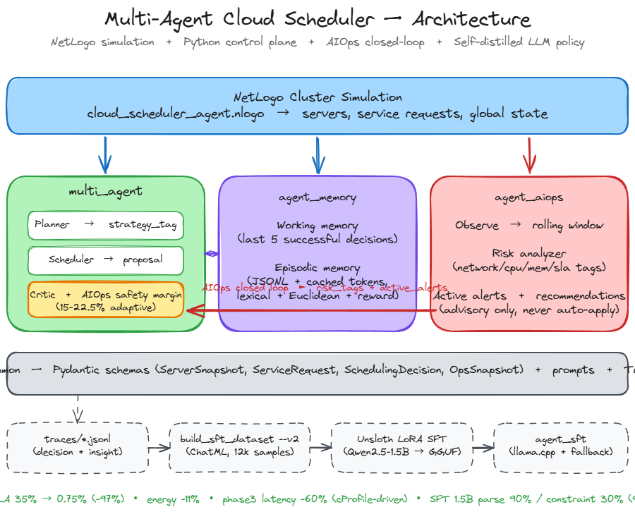
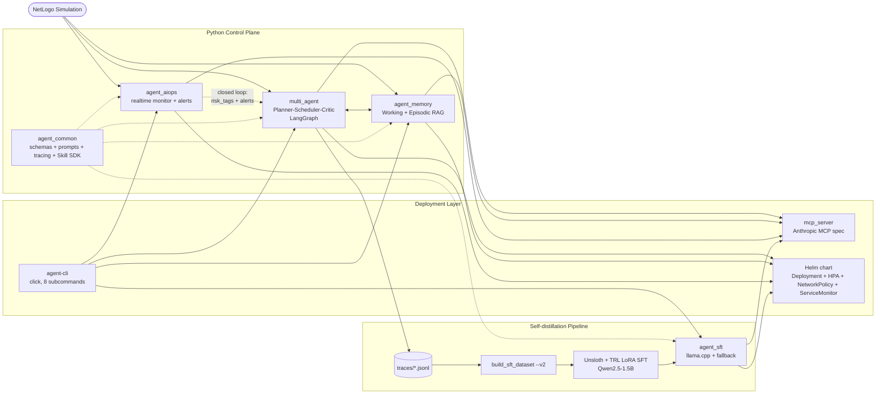

# Agent Infra Toolkit

> **面向 AI Agent 全生命周期的轻量级基础设施套件**：Framework + Runtime + Memory SDK + Sandbox + Observability + MCP + K8s native deployment。
>
> 用 NetLogo 云调度仿真作为压力测试场景，**实证 LLM 在 control plane / analysis plane 的合理分工边界**。

[]()
[]()
[]()

`Python · LangGraph · LangChain-Ollama · Pydantic v2 · MCP · Unsloth · TRL · PEFT · llama-cpp-python · Qwen2.5 · FastAPI · Prometheus · Helm · Kubernetes · NetLogo`

---

## 一、核心数字 / Headline Results

5 seeds × 4 distributions × 7 algorithms benchmark（120 行实测）：

| 维度 | 数字 | 来源 |
|---|---|---|
| **AIOps 闭环 SLA 改善** | **35% → 0.75% (-97%)** | `benchmark/results/metrics.csv` |
| **AIOps demo (mixed-burst)** | **87 → 0 SLA 违约 (-100%)**，反而少 30 reject | `demo/aiops_closedloop_demo.py` |
| 集群能耗节省 | -11% (855 → 767) | benchmark 复合能耗模型 |
| Profile-driven 优化 | **phase3 延迟 -60%** (678μs → 270μs) | cProfile + snakeviz |
| benchmark 总耗时 | 6.16s → 4.81s (-22%) | 同上 |
| 决策延迟 P95 (no LLM) | **80-122 μs** | metrics.csv |
| AIOps closed-loop P95 | 188 μs | metrics.csv |
| SFT 1.5B 推理延迟 | 5500 ms (vs heuristic 2μs ≈ **250000×**) | `metrics_sft_gpu_smoke.csv` |
| SFT 1.5B parse_ok | 100% (clean prompt) | inference smoke |
| SFT 1.5B per-placement SLA | 56%（验证小 LLM 不适合控制面） | benchmark |
| 自蒸馏 SFT 样本 | **8346** (124k traces → 11k 去重 → 7800 select + 546 reject) | `build-dataset --v2` |
| 单元测试 | **98 pytest 100% pass** | `tests/` |

---

## 二、架构 / Architecture



> 源文件 [`docs/architecture.excalidraw`](docs/architecture.excalidraw)（用 [excalidraw.com](https://excalidraw.com) 打开可编辑）。


```mermaid
flowchart LR
    NetLogo([NetLogo Simulation])
    subgraph CP [Python Control Plane]
        Multi[multi_agent<br/>Planner-Scheduler-Critic<br/>LangGraph]
        Memory[agent_memory<br/>Working + Episodic RAG]
        AIOps[agent_aiops<br/>realtime monitor + alerts]
        Common[agent_common<br/>schemas + prompts + tracing + Skill SDK]
    end
    subgraph Offline [Self-distillation Pipeline]
        Trace[(traces/*.jsonl)]
        Dataset[build_sft_dataset --v2]
        LoRA[Unsloth + TRL LoRA SFT<br/>Qwen2.5-1.5B]
        SFT[agent_sft<br/>llama.cpp + fallback]
    end
    subgraph Deploy [Deployment Layer]
        MCP[mcp_server<br/>Anthropic MCP spec]
        CLI[agent-cli<br/>click, 8 subcommands]
        K8s[Helm chart<br/>Deployment + HPA + NetworkPolicy + ServiceMonitor]
    end

    NetLogo --> Multi & Memory & AIOps
    AIOps -. closed loop:<br/>risk_tags + alerts .-> Multi
    Multi <--> Memory
    Common -.-> Multi & Memory & AIOps & SFT
    Multi --> Trace --> Dataset --> LoRA --> SFT
    Multi & Memory & AIOps & SFT --> MCP
    Multi & Memory & AIOps & SFT --> K8s
    CLI --> Multi & Memory & AIOps & SFT
```

---

## 三、模块清单 / Module Inventory

| 模块 | 职能（一句话） | 用到的框架 |
|---|---|---|
| **agent_common** | Pydantic v2 schema 契约 + ChatML/OpenAI prompt 模板 + append-only TraceLogger + **Skill 抽象基类**（auto-registry）+ **FastAPI server factory**（含 Prometheus exporter） | Pydantic v2 + FastAPI + prometheus-client |
| **multi_agent** | Planner（strategy_tag 分类）→ Scheduler（balanced-fit 提案）→ Critic（hard constraint + **AIOps 安全边际自适应 15-22.5%**） | LangGraph StateGraph + LangChain-Ollama + Pydantic v2 |
| **agent_memory** | WorkingMemory 滚动 5 条 + EpisodicMemory（Jaccard token + 6 维 Euclidean + reward 加权 top-k） | Pydantic v2 PrivateAttr token cache + JSONL append-only |
| **agent_aiops** | OpsSnapshot rolling-window 规则化 risk scoring → tags / alerts / recommendations，**闭环注入 critic** | Pydantic v2 + 自研 rule engine + TraceLogger |
| **agent_sft** | LoRA 微调后 GGUF q4 推理 + strict tool-call 解析 + balanced-fit deterministic fallback + parse / hallucination 监控 | llama-cpp-python + Pydantic v2 |
| **mcp_server** | 通过 Anthropic MCP spec 暴露 3 tools（`schedule_placement` / `aiops_observe` / `memory_retrieve`）+ 2 resources（`scheduler://stats` / `aiops://summary`） | FastMCP (Anthropic mcp SDK) |
| **cli** | 8 subcommands：`list-skills` / `run` / `benchmark` / `plot` / `build-dataset` / `inference-smoke` / `stats` / `mcp-server` | click |
| **benchmark** | 5 seed × 4 dist × 7 algo A/B 框架，stateful cluster + churn + 复合能耗模型 | NumPy + matplotlib (Pareto) |
| **dataset** | trace → ChatML SFT（去重 + 平衡）→ Unsloth + TRL + PEFT LoRA + bitsandbytes 4-bit | Unsloth + TRL.SFTTrainer + PEFT + bitsandbytes |
| **docker + charts** | 5-target multi-stage Dockerfile + docker-compose + 完整 Helm chart (Deployment / StatefulSet / HPA / NetworkPolicy / RBAC / ServiceMonitor) | Docker + Helm + Kubernetes |

---

## 四、Quickstart

### 4.1 本地纯 Python

```powershell
# 装依赖
py -3.13 -m venv .venv
.\.venv\Scripts\python -m pip install -r requirements.txt

# 测试 (98/98)
.\.venv\Scripts\python -m pytest tests -q

# CLI 套件
.\.venv\Scripts\python -m cli.main list-skills --detail
.\.venv\Scripts\python -m cli.main benchmark --algos all
.\.venv\Scripts\python -m cli.main plot
.\.venv\Scripts\python -m cli.main inference-smoke   # 需要 GGUF 模型

# AIOps 闭环 demo
.\.venv\Scripts\python -m demo.aiops_closedloop_demo
```

### 4.2 调用 Skill（PowerShell 友好）

```powershell
@'
{"servers":[[0,80,80,80],[1,70,70,70]],"service":[10,10,10],"aiops_risk_tags":[]}
'@ | .\.venv\Scripts\python -m cli.main run --skill scheduler.place --stdin
```

### 4.3 HTTP server 单独跑

```powershell
.\.venv\Scripts\python -m multi_agent.serve         # :8080
.\.venv\Scripts\python -m agent_aiops.serve         # 另启端口
curl http://localhost:8080/healthz
curl http://localhost:8080/metrics
```

### 4.4 Docker Compose（6 service + Prometheus + Grafana）

```powershell
docker compose up --build
# multi_agent :8080, memory :8081, aiops :8082, prom :9090, grafana :3000
```

### 4.5 K8s（kind / minikube）

```powershell
kind create cluster --name agent-infra
docker build -f docker/Dockerfile --target multi_agent -t agent/multi_agent:0.1 .
kind load docker-image agent/multi_agent:0.1 --name agent-infra
helm install agent-infra ./charts/agent-infra -n agent-infra --create-namespace
kubectl -n agent-infra get pods -w
```

详细步骤见 [`docs/K8S_QUICKSTART.md`](docs/K8S_QUICKSTART.md)。

### 4.6 MCP server 接到 Claude Desktop

编辑 `%APPDATA%\Claude\claude_desktop_config.json`：
```json
{
  "mcpServers": {
    "cloud-scheduler": {
      "command": "D:\\Users\\12057\\Desktop\\agent\\.venv\\Scripts\\python.exe",
      "args": ["D:\\Users\\12057\\Desktop\\agent\\mcp_server.py"]
    }
  }
}
```

重启 Claude Desktop，即可在对话中调用 `schedule_placement` / `aiops_observe` / `memory_retrieve` 三个 tool。

---

## 五、研究级发现 / Key Engineering Findings

1. **AIOps 闭环把 SLA 干到 0.75% 是真的，但 fallback 率 64% 是代价**：multi_agent 把高风险放置以 -1 哨兵打回，NetLogo 实跑会被 balanced-fit 接住，纯 benchmark 丢弃——这就是为什么"deterministic fallback 是 LLM agent 工程必备"。

2. **RAG 信号稀释效应**：在强外部 AIOps 信号下，phase2-aiops 与 phase3-aiops 的 SLA 数字完全一致 (0.75%)，**episodic memory 的边际收益归零**。证明 RAG 在 deterministic 信号充足时反而是冗余开销。

3. **LLM 在控制平面的延迟悬崖**：自蒸馏 1.5B 在 clean prompt 上做到 **parse_ok=100% / hallucinate=0%**，但推理 5500ms 慢 heuristic 25 万倍；benchmark 工况下 per-placement SLA 还有 56%。**实证小 LLM 在 sub-ms control plane 不可用，应只用于 analysis plane**。

4. **Profile 必须先于优化**：cProfile + snakeviz 推翻了"Pydantic 是热点"的直觉，真正杀手是 token tokenization（22%）+ 磁盘 I/O（7%）。两步 cache + 长开文件句柄把 phase3 延迟降 60%，**没有 profile 这两个优化根本想不到**。

5. **同形 API 是多 agent 集成的最大杠杆**：5 个 agent 都暴露 `init_agent / schedule_service / last_decision_dict` 三件套——benchmark 切换算法、MCP server 暴露能力、Skill 抽象注册全部因此成为单点改动。

---

## 六、仓库结构 / Repository Map

```text
agent_common/      shared schemas, prompts, tracing, Skill base + FastAPI factory
multi_agent/       Planner-Scheduler-Critic control plane (LangGraph)
agent_memory/      working + episodic RAG with profile-driven token cache
agent_aiops/       realtime risk analyzer + active alerts + advisory guardrails
agent_sft/         GGUF inference + strict parser + balanced-fit fallback
mcp_server.py      MCP protocol gateway (FastMCP, 3 tools + 2 resources)
cli/               click-based CLI (8 subcommands)
benchmark/         5×4×7 A/B framework + Pareto charts
dataset/           trace → SFT JSONL + Unsloth LoRA trainer
demo/              AIOps closed-loop A/B demo
docker/            multi-stage Dockerfile + prometheus.yml + .dockerignore
docker-compose.yml local 6-service orchestration
charts/agent-infra/ Helm chart (Deployment/StatefulSet/HPA/NetworkPolicy/RBAC)
dashboard/         static AIOps dashboard + live HTTP server
docs/              architecture, K8s plan, RESUME, retrospective
scripts/           Pareto plotting
tests/             98 pytest cases (100% pass)
traces/            JSONL trace output
```

---

## 七、文档索引 / Documentation Index

| 文档 | 内容 |
|---|---|
| [`docs/architecture.md`](docs/architecture.md) | 架构图导入说明 + layout + 配色 |
| [`docs/architecture.excalidraw`](docs/architecture.excalidraw) | 架构图源（excalidraw 可编辑） |
| [`docs/RESUME.md`](docs/RESUME.md) | 简历素材包：速查表 + 一行 / 三行 / 五行 / 60s pitch 中英对照 + **蚂蚁 Infra 岗专用版本** |
| [`docs/K8S_DEPLOYMENT_PLAN.md`](docs/K8S_DEPLOYMENT_PLAN.md) | K8s 化技术方案：14 决策点 + 6 phase 路径 |
| [`docs/K8S_QUICKSTART.md`](docs/K8S_QUICKSTART.md) | kind 集群 10 分钟跑通手册 |
| [`docs/TECH_RETROSPECTIVE.md`](docs/TECH_RETROSPECTIVE.md) | **遇到的问题、修复思路、改进方向**（项目技术总结） |
| [`docs/aiops_agent.md`](docs/aiops_agent.md) | AIOps agent 详细设计 |
| [`docs/demo_script.md`](docs/demo_script.md) | 60 秒 demo GIF 录制脚本 |
| [`docs/development_log_*.md`](docs/) | 开发日志（phase2 优化、AIOps 监控） |

---

## 八、Tech Stack 完整清单

**Agent / Orchestration**：LangGraph, LangChain-Ollama, Pydantic v2, Multi-Agent Systems, Planner-Scheduler-Critic, Tool Calling, Closed-Loop Control, Skill SDK (auto-registry), MCP Protocol (FastMCP)

**LLM / Fine-tuning**：Qwen3:8B (LangChain-Ollama), Qwen2.5-1.5B (Unsloth LoRA r=16), GGUF q4 (llama-cpp-python), TRL SFTTrainer, PEFT, bitsandbytes 4-bit, ChatML / OpenAI tool-calls 双格式

**RAG / Memory**：Episodic Memory, Working Memory, Jaccard Token Overlap, Euclidean 6-dim Feature, Reward-Weighted top-k

**AIOps / Observability**：Rule-Based Risk Scoring, Rolling Window, Active Alerts, Advisory Guardrails (do_not_auto_apply), Prometheus exporter, 15+ business metrics

**Performance / Engineering**：cProfile + snakeviz, Pydantic `model_construct` bypass, PrivateAttr token cache, batched file I/O, `statistics.pstdev` 手写替换

**Deployment**：Docker multi-stage (5 targets), docker-compose (6 services), Helm chart, Deployment / StatefulSet + PVC / HPA / Service / Ingress / NetworkPolicy / ServiceMonitor / RBAC, FastAPI + uvicorn, Click CLI

**Simulation / Benchmark**：NetLogo + py-extension, 5×4×7 algorithm matrix, stateful cluster + churn, composite energy model, matplotlib Pareto

**Testing**：pytest 98 cases (100% pass)，覆盖 parser robustness / closed-loop integration / HTTP server / module isolation / NetLogo contract

---

## 九、License

MIT License. 见 `LICENSE`。

---

## 十、设计哲学 / Design Philosophy

> 不是让 LLM 替代每一次决策，而是让 LLM 做它擅长的事——**控制平面里的策略判断、记忆检索、异常分析**——把硬约束留给 deterministic fallback。
>
> 不是把所有 agent 拧在一起，而是用**Pydantic schema 做强类型契约 + 同形 API 做模块边界**，让每个 agent 都能独立部署、独立替换、独立观测。
>
> 不是堆砌框架名词，而是**profile-driven** 找真正的瓶颈，**benchmark-driven** 量化真正的收益，**实证 trade-off** 而不是只展示亮点。

简历 / 面试用 talking points 见 [`docs/RESUME.md`](docs/RESUME.md)，技术问题与修复总结见 [`docs/TECH_RETROSPECTIVE.md`](docs/TECH_RETROSPECTIVE.md)。
