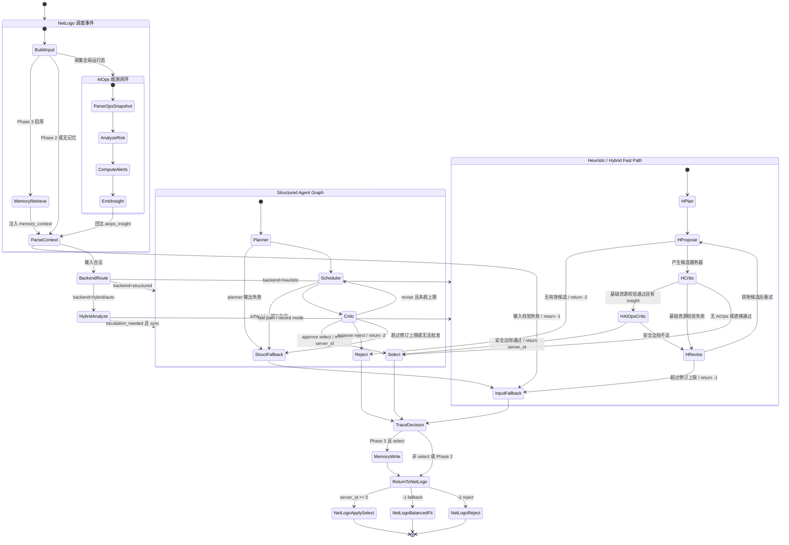

# 项目详情汇报：多智能体云调度系统

## 1. 项目定位

本项目是一个面向云数据中心资源调度的多智能体实验系统。它以 `cloud_scheduler_agent.nlogo` 中的 NetLogo 数据中心仿真为底座，在传统 `first-fit`、`balanced-fit` 调度策略之上，引入 Planner-Scheduler-Critic 控制层、调度记忆层、AIOps 风险监控闭环、离线 trace 蒸馏和可视化 dashboard。

项目的核心判断是：LLM 不适合直接替代每一次高频 placement 决策，但适合作为控制层和分析层的一部分，参与复杂场景识别、风险解释、历史案例复用、异常监控和离线数据蒸馏。在线路径默认保持确定性 fast path，只有在明确配置 `backend="structured"` 或 `hybrid_agent_mode="sync"` 时才调用本地结构化 LLM Agent。

## 2. 建设目标

1. 保留 NetLogo 仿真的原始调度语义，让 Python Agent 只返回 `server_id`、`-1` fallback 或 `-2` reject。
2. 构建稳定的 Agent 控制层：Planner 负责策略分类，Scheduler 负责提出候选服务器，Critic 负责容量、约束和安全边际校验。
3. 引入 Phase 3 调度记忆，使相似历史 placement 能以 working memory + episodic retrieval 的形式回注调度控制层。
4. 建立 AIOps 闭环，对 CPU、内存、网络、SLA、迁移、容量和能耗风险进行实时观测，并把 risk tags / active alerts 回注给 Critic。
5. 统一 trace 输出，使 benchmark、dashboard、SFT 数据构建和后续模型训练复用同一套 JSONL 决策记录。

## 3. 仓库结构

| 路径 | 作用 |
|---|---|
| `cloud_scheduler_agent.nlogo` | NetLogo 仿真主模型，提供 baseline、Phase 2/3 Agent 调度入口和 AIOps 观测入口。 |
| `agent_common/` | 公共契约层，包含 Pydantic schemas、prompt 渲染和 JSONL tracing。 |
| `multi_agent/` | Phase 2 核心控制层，实现 Planner-Scheduler-Critic、hybrid fast path、structured graph 和统计观测。 |
| `agent_memory/` | Phase 3 调度记忆层，维护 working memory、episodic memory，并把相似案例注入 `multi_agent`。 |
| `agent_aiops/` | AIOps 监控层，实时分析运行态风险，生成建议、guardrails 和 active alerts。 |
| `agent_sft/` | SFT/LoRA 推理适配器，支持 GGUF 模型、严格 tool-call 解析和 deterministic fallback。 |
| `benchmark/` | 批量评测 6 条调度路径，输出 SLA、拒绝率、fallback、能耗和延迟等指标。 |
| `dataset/` | 把 trace 转换为 OpenAI tool-call 或 ChatML SFT 数据，并提供 Unsloth LoRA 训练脚本。 |
| `dashboard/` | AIOps 静态和 live dashboard，用于展示风险趋势、服务器矩阵、事件流和 guardrails。 |
| `tests/` | 覆盖 scheduler、memory、AIOps、dashboard、trace、benchmark、NetLogo 集成和 SFT parser。 |
| `docs/` | 架构图、设计文档、开发日志、演示脚本、报告草稿和简历材料。 |

## 4. 核心模块说明

### 4.1 NetLogo 仿真层

NetLogo 仍是系统的真实仿真执行者。它负责生成服务器状态、服务请求、集群全局运行态，并执行最终 placement、fallback 或 reject。Python 侧只负责给出调度信号：

- `>= 0`：选择指定服务器。
- `-1`：请求 NetLogo fallback，通常由 `balanced-fit` 兜底。
- `-2`：拒绝服务请求。

这让 Agent 层不会绕过仿真器直接修改全局状态，降低了 LLM 或 Python 控制层出错时的破坏面。

### 4.2 公共契约层 `agent_common`

`agent_common` 提供跨 Agent 复用的结构化输入输出：

- `ServerSnapshot`：候选服务器资源余量。
- `ServiceRequest`：服务请求的 CPU/RAM/NET 需求。
- `SchedulingContext`：一次调度的完整上下文。
- `SchedulingDecision`：统一的 select/reject/fallback 决策记录。
- `TraceLogger`：把 messages、tool calls、decision、latency 和 fallback 原因写入 JSONL trace。

这层的价值是让 `multi_agent`、`agent_memory`、`agent_aiops`、`dataset` 和 `dashboard` 共用同一套数据契约。

### 4.3 Phase 2 控制层 `multi_agent`

`multi_agent.schedule_service(...)` 是在线调度核心入口。它先解析服务器、服务请求、全局风险、记忆上下文和 AIOps insight，然后根据 backend 路由：

- `backend="heuristic"`：直接走确定性 Planner-Scheduler-Critic fast path。
- `backend="hybrid"` 或 `backend="auto"`：先分析复杂度与全局风险，默认记录 escalation metadata，但仍走 fast path；只有 `hybrid_agent_mode="sync"` 且复杂度触发时才调用 structured graph。
- `backend="structured"`：直接进入 LangGraph 风格的 Planner -> Scheduler -> Critic 图。

Heuristic 路径中，Planner 根据服务请求压力选择 `balanced`、`cpu-pressure`、`memory-pressure` 或 `network-pressure` 等策略标签；Scheduler 从有效候选中按资源均衡度打分；Critic 校验 placement 后的 CPU/RAM/NET 余量。若 AIOps insight 存在，基础 Critic 通过后还会再经过 AIOps-aware critic 的安全边际检查。

### 4.4 Phase 3 记忆层 `agent_memory`

`agent_memory.schedule_service(...)` 是 `multi_agent` 外侧的一层增强包装：

1. 根据当前服务器状态和服务请求生成摘要与特征。
2. 从 episodic memory 中检索 top-k 相似历史案例。
3. 组合 working memory 与 episodic episodes 为 `memory_context`。
4. 调用 `multi_agent.schedule_service(...)`。
5. 如果本次成功 select，则把决策写入 working memory 和 episodic memory。

它的定位是 case-based scheduling memory，不是通用文档问答 RAG。实际结果显示，在没有 AIOps 强信号时 memory 有一定边际价值；当 AIOps 闭环强力介入后，外部风险信号会稀释 episodic memory 的增益。

### 4.5 AIOps 闭环 `agent_aiops`

`agent_aiops.observe_ops_state(...)` 每 tick 或每次调度后消费全局运行态，计算：

- `risk_score`
- `risk_level`
- `risk_tags`
- `active_alerts`
- `recommendations`
- `guardrails`
- `evidence`

风险来源包括网络利用率、CPU/内存利用率、自动迁移、整合迁移、SLA 违约、重调度、拒绝服务和能耗回退。输出的 insight 会回注到 `multi_agent`，其中 AIOps-aware critic 会在 `network-pressure`、`cpu-pressure`、`memory-pressure`、`sla-risk`、`capacity-risk` 等标签出现时提高资源 headroom 要求。持续出现的 active alert 会把安全边际提升到 1.5 倍。

AIOps v1 是 advisory + guardrail 层，不直接改 NetLogo 参数，也不直接选择服务器。

### 4.6 Benchmark、Dashboard 与 SFT

Benchmark 路径比较 `first-fit`、`balanced-fit`、`AI-phase2`、`AI-phase3`、`AI-phase2 + AIOps`、`AI-phase3 + AIOps` 等策略。Dashboard 读取 trace 或 live API，把 AIOps 风险、资源状态和事件流可视化。SFT pipeline 则从 trace 构建训练数据，支持 OpenAI tool-call v1 和 ChatML v2，并可用 Unsloth 训练 Qwen2.5-1.5B LoRA，再通过 `agent_sft` 做推理对比。

## 5. 运行时闭环

一次完整调度的大致流程如下：

1. NetLogo 产生候选服务器、服务请求和全局运行态。
2. 若运行 Phase 3，`agent_memory` 先检索历史案例，构造 `memory_context`。
3. AIOps 读取全局运行态，生成 `risk_tags`、`risk_level`、`risk_score` 和 `active_alerts`。
4. `multi_agent` 解析上下文，按 backend 进入 heuristic、hybrid 或 structured 路由。
5. Planner 选择策略标签；Scheduler 提出 select/reject；Critic 校验基础资源约束。
6. 若 AIOps insight 可用，AIOps-aware critic 继续检查安全边际。
7. 决策被记录到 trace，并返回 NetLogo：
   - select：NetLogo 执行 placement；
   - fallback：NetLogo 走 balanced-fit 兜底；
   - reject：NetLogo 拒绝服务。
8. 成功 select 时，Phase 3 记忆层写入新的 working/episodic episode。

## 6. Agent 编排状态图



## 7. 关键实验结果

README 中记录的 5 seeds × 4 distributions × 6 algorithms 均值显示：

| 策略 | SLA 违约率 | 拒绝率 | Fallback 率 | 能耗 | 平均延迟 | P95 延迟 | AIOps 触发率 |
|---|---:|---:|---:|---:|---:|---:|---:|
| first-fit | 40.60% | 43.05% | 0% | 861 | 0.6 μs | 0.8 μs | - |
| balanced-fit | 34.55% | 43.70% | 0% | 855 | 2 μs | 4 μs | - |
| AI-phase2 | 36.05% | 41.90% | 0% | 856 | 80.7 μs | 122.5 μs | - |
| AI-phase3 | 33.50% | 44.45% | 0% | 856 | 270.7 μs | 435.9 μs | - |
| AI-phase2 + AIOps | 0.75% | 21.25% | 64.65% | 767 | 120.4 μs | 188.2 μs | 80.1% |
| AI-phase3 + AIOps | 0.75% | 22.30% | 64.30% | 770 | 196.1 μs | 294.5 μs | 79.5% |

主要结论：

- AIOps 闭环把 SLA 违约率从 33%-40% 降到 0.75%，相对降幅超过 97%。
- AIOps 同时降低能耗代理指标，`balanced-fit` 的 855 降到 `AI-phase2 + AIOps` 的 767，约 11%。
- 代价是 fallback 率明显升高，约 64% 的高风险请求被 Critic 打回 NetLogo 兜底。
- `AI-phase2 + AIOps` 在 SLA 和延迟维度上形成当前 Pareto 最优点。
- Phase 3 记忆在 AIOps 强信号下边际收益下降，但 AIOps 也减少了高风险 episode 写入，降低了记忆污染。

## 8. 工程亮点

1. 在线路径采用 deterministic fast path，避免每 tick 调 LLM 导致不可控延迟。
2. Structured Agent 被限制在明确配置的 demo、离线 trace 或复杂场景同步路径中。
3. Critic 是核心安全门，既校验基础资源约束，也消费 AIOps 风险信号。
4. AIOps 只提供 insight、recommendation 和 guardrail，不直接自动改策略，控制面边界清晰。
5. Trace 是统一事实源，支撑评测、dashboard、SFT 数据集和后续模型对比。
6. SFT 实验验证了小模型可以学习 tool-call 语法，但很难可靠学习调度约束；因此 deterministic fallback 是必要工程保护。

## 9. 已知限制

1. 本地 8B LLM 同步调度延迟较高，不适合作为 NetLogo 高频仿真的默认路径。
2. AIOps-aware critic 当前主要作用于 heuristic/hybrid fast path；structured graph 路径更多是透传 AIOps metadata。
3. Phase 3 memory 是案例检索，不是通用知识库；效果取决于历史 episode 分布。
4. Benchmark 中 fallback 的语义与 NetLogo 实跑有所差异：纯 benchmark 记录 fallback 率，而 NetLogo 实际运行会由 balanced-fit 接住。
5. SFT/LoRA 模型的格式遵循能力高于约束推理能力，仍需要严格 parser 和兜底策略。

## 10. 运行入口

常用命令：

```powershell
.\.venv\Scripts\python -m pytest tests -q
.\.venv\Scripts\python -m demo.aiops_closedloop_demo
.\.venv\Scripts\python -m benchmark.runner
.\.venv\Scripts\python -m dashboard.live_server --trace-dir traces --port 8000
.\.venv\Scripts\python -m dataset.build_sft_dataset --v2 --max-samples 12000
```

## 11. 总结

该项目不是简单把 LLM 放进调度循环，而是把 LLM/Agent 能力拆到更适合的位置：在线高频 placement 由确定性路径负责，复杂度识别、Critic 校验、历史记忆、AIOps 风险监控、离线 trace 蒸馏和可视化分析共同组成控制层。当前结果说明，AIOps 闭环是提升 SLA 的主要贡献点，而 deterministic fallback 和结构化契约是保证系统可运行、可评测、可复现的关键。
